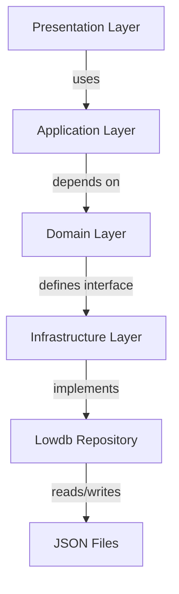

# Next Step: CRUD Operations with Clean Architecture

## Overview
Implement CRUD operations following Domain-Driven Design and Clean Architecture principles, with persistent storage and WebSocket communication.

## Architecture Layers

```
┌─────────────────────────────────────────────────┐
│                 Presentation Layer               │
│  ┌─────────────┐    ┌─────────────────────────┐  │
│  │ WebSocket  │    │         HTTP API        │  │
│  │ Controller │    │      (Optional)         │  │
│  └─────────────┘    └─────────────────────────┘  │
└─────────────────────────────────────────────────┘
┌─────────────────────────────────────────────────┐
│                 Application Layer                │
│  ┌─────────────┐    ┌─────────────────────────┐  │
│  │ Use Cases  │    │    Application         │  │
│  │ (Commands) │    │       Services         │  │
│  └─────────────┘    └─────────────────────────┘  │
└─────────────────────────────────────────────────┘
┌─────────────────────────────────────────────────┐
│                 Domain Layer                     │
│  ┌─────────────┐    ┌─────────────────────────┐  │
│  │ Entities   │    │    Domain Services      │  │
│  │ (Game,     │    │    (Business Rules)    │  │
│  │  Card)     │    │                         │  │
│  └─────────────┘    └─────────────────────────┘  │
└─────────────────────────────────────────────────┘
┌─────────────────────────────────────────────────┐
│                 Infrastructure Layer             │
│  ┌─────────────┐    ┌─────────────────────────┐  │
│  │ Repositories│    │    External Services   │  │
│  │ (JSON File) │    │    (WebSocket, etc.)   │  │
│  └─────────────┘    └─────────────────────────┘  │
└─────────────────────────────────────────────────┘
```

## Domain Layer (Core Business Logic)

### 1. Entities
- **File**: `apps/mist-server/domain/entities.ts`
- **Implementation**:
  ```typescript
  export class Game {
    constructor(
      public readonly id: string,
      public name: string,
      public description: string
    ) {
      // Business rule validation
      if (name.length < 3) throw new Error("Game name too short")
      if (description.length > 500) throw new Error("Description too long")
    }
    
    // Business methods
    updateName(newName: string): void {
      if (newName.length < 3) throw new Error("Game name too short")
      this.name = newName
    }
    
    updateDescription(newDescription: string): void {
      if (newDescription.length > 500) throw new Error("Description too long")
      this.description = newDescription
    }
    
    // Derived properties
    get isValid(): boolean {
      return this.name.length >= 3 && this.description.length <= 500
    }
  }
  
  export class Card {
    constructor(
      public readonly id: string,
      public name: string,
      public readonly gameId: string
    ) {
      // Business rule validation
      if (name.length < 2) throw new Error("Card name too short")
      if (name.length > 100) throw new Error("Card name too long")
    }
    
    // Business methods
    updateName(newName: string): void {
      if (newName.length < 2) throw new Error("Card name too short")
      if (newName.length > 100) throw new Error("Card name too long")
      this.name = newName
    }
    
    // Domain logic
    belongsToGame(gameId: string): boolean {
      return this.gameId === gameId
    }
  }
  ```

### 2. Domain Services
- **File**: `apps/mist-server/domain/services.ts`
- **Implementation**:
  - Game validation service
  - Card validation service
  - Business rule enforcement
  - No dependencies on external layers

### 3. Repositories (Interfaces)
- **File**: `apps/mist-server/domain/repositories.ts`
- **Implementation Options**:

#### Option A: Synchronous Interface (Recommended for simple cases)
```typescript
export interface GameRepository {
  findAll(): Game[]
  findById(id: string): Game | null
  save(game: Game): void
  delete(id: string): void
}

export interface CardRepository {
  findByGameId(gameId: string): Card[]
  findById(id: string): Card | null
  save(card: Card): void
  delete(id: string): void
}
```

#### Option B: Asynchronous Interface (For complex I/O)
```typescript
export interface GameRepository {
  findAll(): Promise<Game[]>
  findById(id: string): Promise<Game | null>
  save(game: Game): Promise<void>
  delete(id: string): Promise<void>
}
```

**Recommendation**: Start with synchronous interface since:
- JSON file operations can be synchronous for this scale
- Simpler code without async/await boilerplate
- Easier to test
- Can refactor to async later if needed

## Infrastructure Layer Implementation

The Lowdb implementation is properly placed in the Infrastructure Layer, implementing the repository interfaces defined by the Domain Layer.

### Lowdb Repository in Infrastructure Layer



### Why This Placement is Correct

1. **Separation of Concerns**: Lowdb handles persistence details, keeping domain layer clean
2. **Dependency Rule**: Domain layer defines interfaces, infrastructure implements them
3. **Replaceability**: Easy to swap Lowdb for another implementation without changing business logic
4. **Testability**: Can mock repository interface for unit testing domain logic

### Data Flow

```
WebSocket Message → WebSocket Controller → Use Case → Repository → JSON File
                          ↑                     ↑
                      (Presentation)      (Domain Interface)
```

## Final Recommendation: Lowdb

**Use Option B (Lowdb)** as the primary solution because:

### Benefits
- **Mature & Well-Tested**: Battle-tested in production environments
- **Simple API**: Easy to learn and use
- **Built-in Caching**: Automatic in-memory caching
- **Atomic Writes**: Safe file operations
- **TypeScript Support**: First-class TypeScript types
- **Active Maintenance**: Regularly updated
- **Small Footprint**: Minimal dependency overhead
- **Extensible**: Supports custom adapters

### Implementation Plan

#### 1. Install Dependencies
```bash
cd apps/mist-server
pnpm add lowdb
pnpm add -D @types/lowdb
```

#### 2. Repository Implementation
```typescript
// apps/mist-server/infrastructure/lowdb_repository.ts
import { Low, JSONFile } from 'lowdb'
import { Game, Card } from '../domain/entities'

export class LowdbGameRepository implements GameRepository {
  private db: Low<{ games: Game[] }>
  
  constructor(private filePath: string) {
    const adapter = new JSONFile<{ games: Game[] }>(filePath)
    this.db = new Low(adapter, { games: [] })
    this.initialize().catch(console.error)
  }
  
  private async initialize(): Promise<void> {
    await this.db.read()
    this.db.data ||= { games: [] }
  }
  
  async findAll(): Promise<Game[]> {
    await this.db.read()
    return this.db.data.games.map(g => new Game(g.id, g.name, g.description))
  }
  
  async findById(id: string): Promise<Game | null> {
    const games = await this.findAll()
    return games.find(g => g.id === id) || null
  }
  
  async save(game: Game): Promise<void> {
    await this.db.read()
    const index = this.db.data.games.findIndex(g => g.id === game.id)
    
    if (index >= 0) {
      // Update existing
      this.db.data.games[index] = game
    } else {
      // Add new
      this.db.data.games.push(game)
    }
    
    await this.db.write()
  }
  
  async delete(id: string): Promise<void> {
    await this.db.read()
    this.db.data.games = this.db.data.games.filter(g => g.id !== id)
    await this.db.write()
  }
  
  // Additional query methods
  async findByNameContaining(text: string): Promise<Game[]> {
    await this.db.read()
    return this.db.data.games
      .filter(g => g.name.toLowerCase().includes(text.toLowerCase()))
      .map(g => new Game(g.id, g.name, g.description))
  }
}

export class LowdbCardRepository implements CardRepository {
  private db: Low<{ cards: Card[] }>
  
  constructor(private filePath: string) {
    const adapter = new JSONFile<{ cards: Card[] }>(filePath)
    this.db = new Low(adapter, { cards: [] })
    this.initialize().catch(console.error)
  }
  
  private async initialize(): Promise<void> {
    await this.db.read()
    this.db.data ||= { cards: [] }
  }
  
  async findByGameId(gameId: string): Promise<Card[]> {
    await this.db.read()
    return this.db.data.cards
      .filter(c => c.gameId === gameId)
      .map(c => new Card(c.id, c.name, c.gameId))
  }
  
  async findById(id: string): Promise<Card | null> {
    await this.db.read()
    const cardData = this.db.data.cards.find(c => c.id === id)
    return cardData ? new Card(cardData.id, cardData.name, cardData.gameId) : null
  }
  
  async save(card: Card): Promise<void> {
    await this.db.read()
    const index = this.db.data.cards.findIndex(c => c.id === card.id)
    
    if (index >= 0) {
      this.db.data.cards[index] = card
    } else {
      this.db.data.cards.push(card)
    }
    
    await this.db.write()
  }
  
  async delete(id: string): Promise<void> {
    await this.db.read()
    this.db.data.cards = this.db.data.cards.filter(c => c.id !== id)
    await this.db.write()
  }
  
  async deleteByGameId(gameId: string): Promise<number> {
    await this.db.read()
    const initialCount = this.db.data.cards.length
    this.db.data.cards = this.db.data.cards.filter(c => c.gameId !== gameId)
    await this.db.write()
    return initialCount - this.db.data.cards.length
  }
}
```

#### 3. Dependency Injection Setup
```typescript
// apps/mist-server/infrastructure/dependency_container.ts
import { LowdbGameRepository } from './lowdb_repository'
import { LowdbCardRepository } from './lowdb_repository'
import path from 'path'

export class Container {
  private static gameRepository: LowdbGameRepository
  private static cardRepository: LowdbCardRepository
  
  static getGameRepository(): LowdbGameRepository {
    if (!this.gameRepository) {
      const dataDir = path.join(__dirname, '../../data')
      this.gameRepository = new LowdbGameRepository(path.join(dataDir, 'games.json'))
    }
    return this.gameRepository
  }
  
  static getCardRepository(): LowdbCardRepository {
    if (!this.cardRepository) {
      const dataDir = path.join(__dirname, '../../data')
      this.cardRepository = new LowdbCardRepository(path.join(dataDir, 'cards.json'))
    }
    return this.cardRepository
  }
}
```

#### 4. Use in Application Layer
```typescript
// apps/mist-server/application/use_cases.ts
import { Container } from '../infrastructure/dependency_container'

export class CreateGameUseCase {
  private gameRepository = Container.getGameRepository()
  
  async execute(name: string, description: string): Promise<Game> {
    const game = new Game(uuidv4(), name, description)
    await this.gameRepository.save(game)
    return game
  }
}
```

### Migration Path

If needs grow beyond Lowdb:
1. **Create new repository implementation** (e.g., SQLite, PostgreSQL)
2. **Implement same interfaces** (GameRepository, CardRepository)
3. **Update dependency container** to use new implementation
4. **Add data migration script** to transfer existing data

### Why Lowdb Wins

| Feature          | Custom Cache | Lowdb | SQLite |
|------------------|-------------|-------|--------|
| Ease of Use      | ⭐⭐⭐       | ⭐⭐⭐⭐⭐ | ⭐⭐⭐  |
| Development Speed| ⭐⭐         | ⭐⭐⭐⭐⭐ | ⭐⭐   |
| Maintenance      | ⭐⭐⭐       | ⭐⭐⭐⭐  | ⭐⭐⭐  |
| Performance     | ⭐⭐⭐       | ⭐⭐⭐⭐  | ⭐⭐⭐⭐⭐|
| Scalability      | ⭐⭐         | ⭐⭐⭐   | ⭐⭐⭐⭐⭐|
| Features         | ⭐⭐         | ⭐⭐⭐⭐  | ⭐⭐⭐⭐⭐|

**Lowdb provides the best balance for this project stage.**

## Application Layer (Use Cases)

### 1. Use Cases (Commands)
- **File**: `apps/mist-server/application/use_cases.ts`
- **Implementation**:
  ```typescript
  export class CreateGameUseCase {
    constructor(private gameRepository: GameRepository) {}
    
    async execute(name: string, description: string): Promise<Game> {
      const game = new Game(uuidv4(), name, description)
      await this.gameRepository.save(game)
      return game
    }
  }
  
  export class CreateCardUseCase {
    constructor(private cardRepository: CardRepository) {}
    
    async execute(gameId: string, name: string): Promise<Card> {
      const card = new Card(uuidv4(), name, gameId)
      await this.cardRepository.save(card)
      return card
    }
  }
  ```

### 2. Application Services
- **File**: `apps/mist-server/application/services.ts`
- **Implementation**:
  - Coordinate multiple use cases
  - Handle transactions
  - Manage application-level concerns

## Infrastructure Layer (Implementation Details)

### 1. Lowdb Repository (Primary Implementation)
- **File**: `apps/mist-server/infrastructure/lowdb_repository.ts`
- **Implementation**: See the complete implementation in the "Final Recommendation: Lowdb" section below
- **Responsibilities**:
  - Persistent storage using JSON files
  - Automatic in-memory caching
  - Atomic write operations
  - Data validation and error handling

### 2. WebSocket Adapter
- **File**: `apps/mist-server/infrastructure/websocket_adapter.ts`
- **Implementation**:
  - Convert WebSocket messages to use case inputs
  - Handle request/response correlation
  - Broadcast domain events to clients

## Presentation Layer (Delivery Mechanisms)

### 1. WebSocket Controller
- **File**: `apps/mist-server/presentation/websocket_controller.ts`
- **Implementation**:
  - Route WebSocket messages to appropriate use cases
  - Handle connection/disconnection
  - Manage client sessions

### 3. WebSocket Integration Layer
- **File**: `apps/mist-server/websocket_handler.ts` (new)
- **Implementation**:
  - Bridge between data model and WebSocket
  - Handle CRUD operations from WebSocket messages
  - Broadcast changes to all clients
  - Maintain operation history for conflict resolution

### 3. Data Model Updates
- **File**: `apps/mist-server/data_model.ts`
- **Changes**:
  - Remove in-memory arrays
  - Add database operations (load/save)
  - Keep same interface for backward compatibility

### 4. WebSocket Server Enhancement
- **File**: `apps/mist-server/websocket_server.ts`
- **Changes**:
  - Implement request/response pattern with correlation IDs
  - Add CRUD operation handlers:
    - `createGame`, `updateGame`, `deleteGame`
    - `createCard`, `updateCard`, `deleteCard`
  - Broadcast real-time updates to all connected clients
  - Implement message validation and error handling
  - Add client connection tracking
  - Implement rate limiting per client
  - Add message logging for debugging

### 5. WebSocket Message Router
- **File**: `apps/mist-server/websocket_router.ts` (new)
- **Implementation**:
  - Centralized message routing
  - Request/response correlation
  - Message validation middleware
  - Error handling pipeline
  - Broadcast management

## Client Architecture (Clean Architecture)

```
┌─────────────────────────────────────────────────┐
│                 Presentation Layer               │
│  ┌─────────────────────────────────────────────┐  │
│  │               React Components              │  │
│  └─────────────────────────────────────────────┘  │
└─────────────────────────────────────────────────┘
┌─────────────────────────────────────────────────┐
│                 Application Layer                │
│  ┌─────────────────────────────────────────────┐  │
│  │          Application Services               │  │
│  │          (Use Case Coordination)            │  │
│  └─────────────────────────────────────────────┘  │
└─────────────────────────────────────────────────┘
┌─────────────────────────────────────────────────┐
│                 Domain Layer                     │
│  ┌─────────────────────────────────────────────┐  │
│  │               Domain Models                │  │
│  │               (Shared with backend)         │  │
│  └─────────────────────────────────────────────┘  │
└─────────────────────────────────────────────────┘
┌─────────────────────────────────────────────────┐
│                 Infrastructure Layer             │
│  ┌─────────────────────────────────────────────┐  │
│  │          WebSocket Service                 │  │
│  │          (Communication Adapter)           │  │
│  └─────────────────────────────────────────────┘  │
└─────────────────────────────────────────────────┘
```

### 1. Domain Layer (Shared with Backend)
- **File**: `apps/mist-client/src/domain/`
- **Implementation**:
  - Same entities as backend (Game, Card)
  - Shared validation logic
  - Domain events

### 2. Application Layer
- **File**: `apps/mist-client/src/application/`
- **Implementation**:
  ```typescript
  // GameService.ts
  export class GameService {
    constructor(private websocket: WebSocketAdapter) {}
    
    async createGame(name: string, description: string): Promise<Game> {
      return this.websocket.sendRequest('createGame', { name, description })
    }
    
    async updateGame(id: string, updates: Partial<Game>): Promise<Game> {
      return this.websocket.sendRequest('updateGame', { id, ...updates })
    }
  }
  ```

### 3. Infrastructure Layer
- **File**: `apps/mist-client/src/infrastructure/websocket.ts`
- **Implementation**:
  ```typescript
  export class WebSocketAdapter {
    private requestId = 0
    private pendingRequests = new Map<number, { resolve: Function, reject: Function }>()
    
    constructor(private socket: WebSocket) {
      socket.onmessage = (event) => this.handleMessage(event)
    }
    
    sendRequest(type: string, data: any): Promise<any> {
      const id = ++this.requestId
      const promise = new Promise((resolve, reject) => {
        this.pendingRequests.set(id, { resolve, reject })
        setTimeout(() => reject(new Error('Timeout')), 5000)
      })
      
      this.socket.send(JSON.stringify({ type, ...data, requestId: id }))
      return promise
    }
    
    private handleMessage(event: MessageEvent) {
      const message = JSON.parse(event.data)
      if (message.requestId) {
        const pending = this.pendingRequests.get(message.requestId)
        if (pending) {
          if (message.type === 'error') {
            pending.reject(new Error(message.message))
          } else {
            pending.resolve(message.data)
          }
          this.pendingRequests.delete(message.requestId)
        }
      }
      // Handle broadcast messages...
    }
  }
  ```

### 4. Presentation Layer
- **File**: `apps/mist-client/src/components/`
- **Implementation**:
  - Dumb components (presentational)
  - Smart components (container) with dependency injection
  - Hooks for state management

### 2. WebSocket Message Protocol
**Request Messages:**
```typescript
// Create Game
{ type: 'createGame', data: { name: string, description: string }, requestId: string }

// Update Game  
{ type: 'updateGame', data: { id: string, name?: string, description?: string }, requestId: string }

// Delete Game
{ type: 'deleteGame', data: { id: string }, requestId: string }

// Create Card
{ type: 'createCard', data: { gameId: string, name: string }, requestId: string }

// Update Card
{ type: 'updateCard', data: { id: string, name?: string, gameId?: string }, requestId: string }

// Delete Card
{ type: 'deleteCard', data: { id: string }, requestId: string }
```

**Response Messages:**
```typescript
// Success
{ type: 'success', requestId: string, data: any }

// Error
{ type: 'error', requestId: string, message: string, code: number }

// Broadcast (real-time updates)
{ type: 'gameCreated', data: Game }
{ type: 'gameUpdated', data: Game }
{ type: 'gameDeleted', data: { id: string } }
{ type: 'cardCreated', data: Card }
{ type: 'cardUpdated', data: Card }
{ type: 'cardDeleted', data: { id: string } }
```

### 3. UI Components
- **Game Management**:
  - Game list with add/edit/delete buttons
  - Game detail view with editable fields
  - Form validation (client-side)
  - Loading states during operations

- **Card Management**:
  - Card list per game with visual representation
  - Card add/edit/delete interface
  - Drag-and-drop card organization
  - Real-time updates from other clients

### 4. State Management
- **File**: `apps/mist-client/src/stores/gameStore.ts`
- **Implementation**:
  - Reactive state for games and cards
  - WebSocket message handlers
  - Optimistic UI updates
  - Conflict resolution for concurrent edits
  - Offline operation queue

## Technical Requirements

### Backend
- Use UUID v4 for all new entities
- Validate all WebSocket message payloads
- Implement proper error codes in responses (400, 404, 500)
- Add WebSocket message rate limiting (100 messages/minute per client)
- Add CORS security headers
- Implement message authentication/authorization
- Add message size limits (16KB max)

### WebSocket Protocol
- Binary JSON encoding for efficiency
- Message compression for large payloads
- Heartbeat/ping-pong for connection health
- Automatic reconnection with exponential backoff
- Message sequencing for reliable delivery

### Client
- WebSocket connection management
- Message serialization/deserialization
- Request timeout handling (5s default)
- Form validation (client-side)
- Loading states for operations
- Error displays with recovery options
- Confirmation dialogs for destructive actions
- Responsive design for all screen sizes
- Offline mode with operation queuing

## Testing

### Backend Tests
- File I/O operations
- API endpoint validation
- Error cases
- Concurrent access

### Client Tests
- Form validation
- API integration
- State updates
- Error handling

## Delivery

1. Backend CRUD implementation
2. Client UI components
3. Integration testing
4. Documentation
5. Demo video

## Timeline
- Backend: 2 days
- Client: 3 days
- Testing: 1 day
- Documentation: 0.5 day